<!DOCTYPE html>
<html lang="en">
<head>
   <meta charset="UTF-8">
   <meta http-equiv="X-UA-Compatible" content="IE=edge">
   <meta name="viewport" content="width=device-width, initial-scale=1.0">
   <link rel="stylesheet" href="css/style.css">
   <title>Self 17</title>
</head>
<body>
   

      <section id="page0" class="page0">
         <header class="header">
            <a id="logo_link" href="#" class="logo_link">
               
Clothes

            </a>
            <nav class="nav">
               <ul class="menu_list">
                  <li class="menu_item">
                     <a onclick="show1()" class="men_link" href="#">
                        page 1
                     </a>
                  </li>
                  <li class="menu_item">
                     <a onclick="show2()" class="men_link" href="#">
                        page 2
                     </a>
                  </li>
                  <li class="menu_item">
                     <a onclick="show3()" class="men_link" href="#">
                        page 3
                     </a>
                  </li>
               </ul>
            </nav>
            

               

            

         </header>
         

            <h1 class="word">
               buy
            </h1>
            <h1 class="word">
               our
            </h1>
            <h1 class="word">
               clothes
            </h1>
         

         <aside id="sidebar" class="sidebar">
            

               

            

            

               <a onclick="show1()" id="link_page" href="#" class="link_page">
                  page 1
               </a>
               <a onclick="show2()" id="link_page" href="#" class="link_page">
                  page 2
               </a>
               <a onclick="show3()" id="link_page" href="#" class="link_page">
                  page 3
               </a>
            

         </aside>
         

            <ul>
               <li></li>
            </ul>
         

      </section>
      <section id="page1" class="page1">
         

            <a onclick="back1()" href="#">back</a>
         

         <h3 id="title" class="title">page 1</h3>
         

            

               <article class="text_next">
                  Lorem ipsum dolor sit amet.
               </article>
               

                  
                  
                  
               

            

         

         

            

               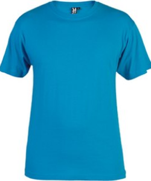
               

                  Shirt - 100%
               

               

                  
T-shirt - 100$, Size - L

               

               

                  

                     
                  

                  

                     Size - L
                  

               

            

            

               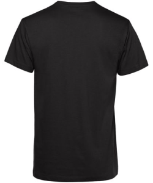
               

                  Shirt - 100%
               

               

                  
T-shirt - 100$, Size - L

               

               

                  

                     
                  

                  

                     Size - L
                  

               

            

            

               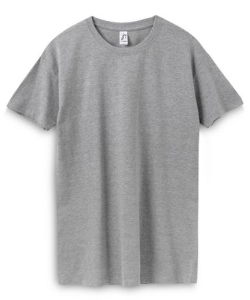
               

                  Shirt - 100%
               

               

                  
T-shirt - 100$, Size - L

               

               

                  

                     
                  

                  

                     Size - L
                  

               

            

            

               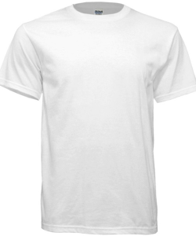
               

                  Shirt - 100%
               

               

                  
T-shirt - 100$, Size - L

               

               

                  

                     
                  

                  

                     Size - L
                  

               

            

            

               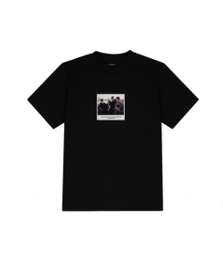
               

                  Shirt - 100%
               

               

                  
T-shirt - 100$, Size - L

               

               

                  

                     
                  

                  

                     Size - L
                  

               

            

         

      </section>
      <section id="page2" class="page2">
         

            <a onclick="back2()" href="#">back</a>
         

         <h3 id="title1" class="title">page 2</h3>
         

            

               <article class="text_next">
                  Lorem ipsum dolor sit amet consectetur adipisicing.
               </article>
               

                  
                  
                  
               

            

         

         

            

               
               <article class="article">Size L Shirt - 100$</article>
               <article class="article2 article21">Size L Shirt - 100$</article>
            

            

               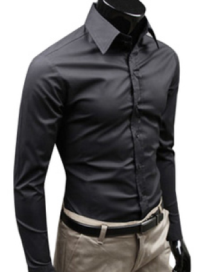
               <article class="article">Size M Shirt - 300$</article>
               <article class="article2 article22">Size M Shirt - 300$</article>
            

            

               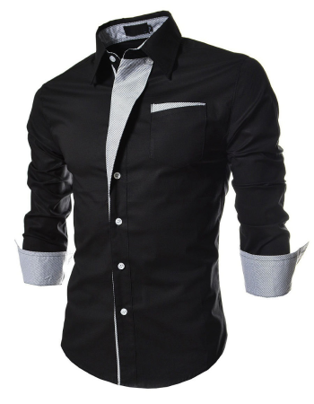
               <article class="article">Size S Shirt - 200$</article>
               <article class="article2 article23">Size S Shirt - 200$</article>
            

         

      </section>
      <section id="page3" class="page3">
         

            <a onclick="back3()" href="#">back</a>
         

         <h3 id="title2" class="title">page 3</h3>
         

            

               <article class="text_next">
                  Lorem ipsum dolor sit amet adipisicing.
               </article>
               

                  
                  
                  
               

            

         

         

            

               <article class="article3 article31 article30">Size L Coat 120$</article>
               <article class="article3 article32 article30">Size M Coat 150$</article>
               <article class="article3 article33 article30">Size S Coat 210$</article>
               <article class="article3 article34 article30">Size XL Coat 650$</article>
               <article class="article3 article35 article30">Size XXL Coat 320$</article>
            

            

               

                  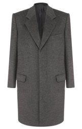
                  
                  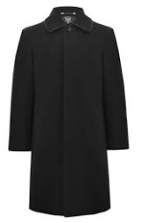
                  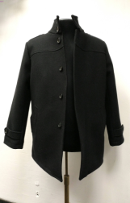
                  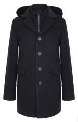
               

            

         

      </section>
   

   
   
</body>
</html>
